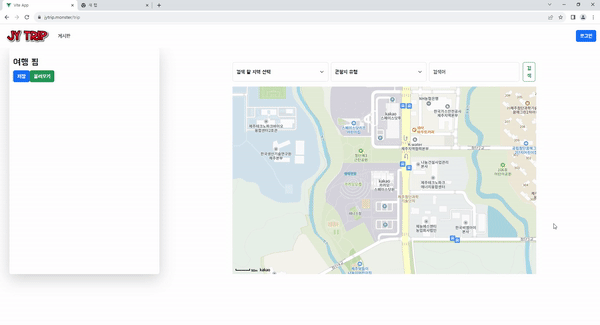
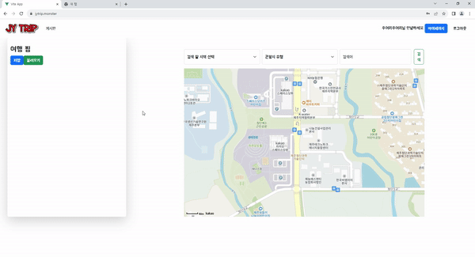
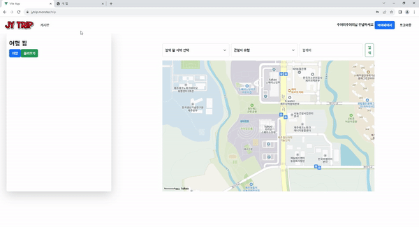
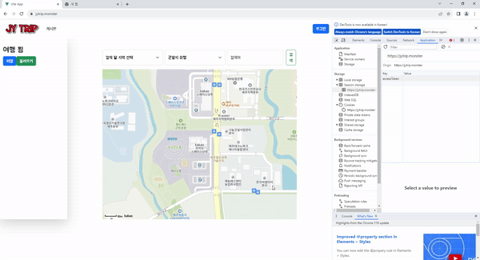
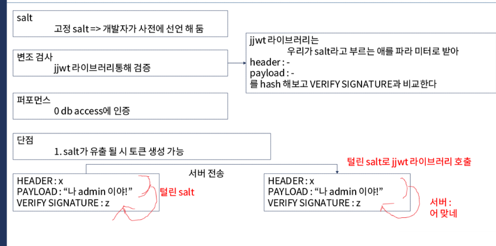
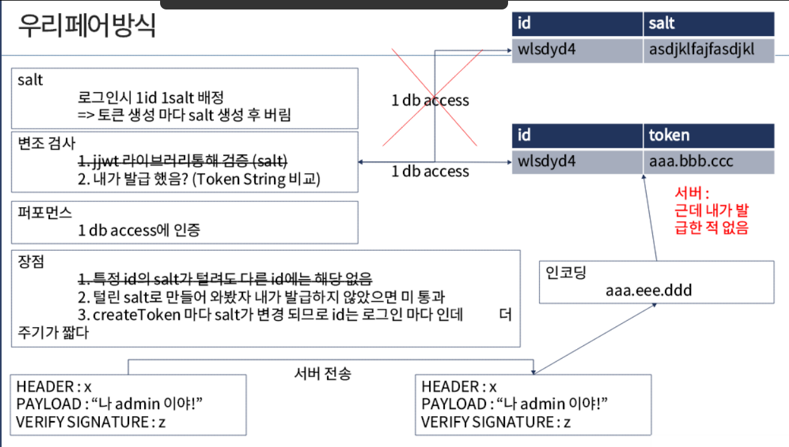
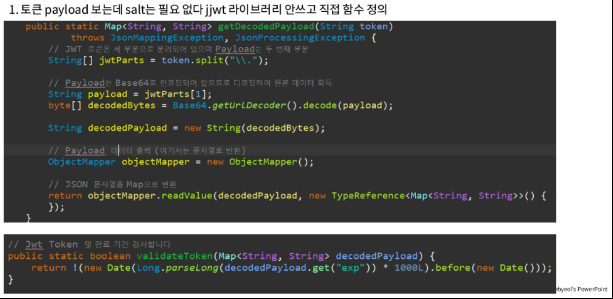
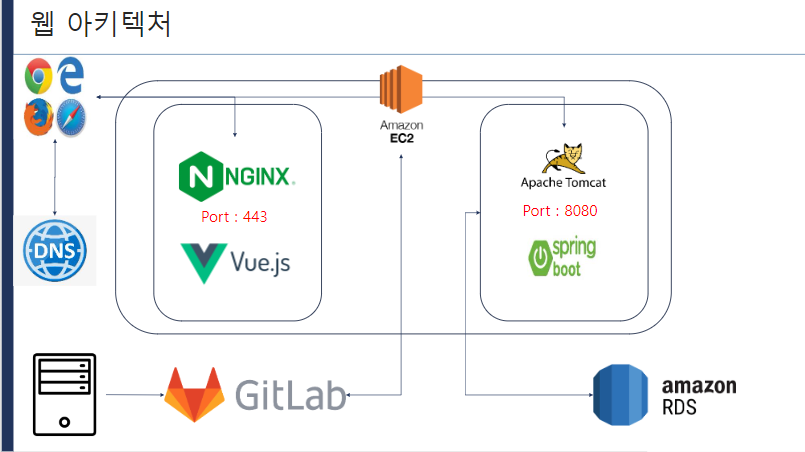

# 여행 계획 짜기 JYTrip (feat. JWT에 대한 고찰)

## [JYTrip 홈페이지](https://jytrip.monster)
## [시연 영상](https://www.notion.so/jinyong3512/ssafy-travel-project-jytrip-3cf43aa7257a4f95b8620fb8a64e656c)

# JYTrip 서비스 화면
## Member
##### 회원가입 

* 아이디, 닉네임 각각 중복 검사 [1 db access]
* 비밀번호 패턴 매칭 확인 *패턴 매칭(대소문자 + 특수기호 + 숫자 10자리 이상)
* 비밀번호 SHA-256 알고리즘으로 암호화해서 저장 => salt와 hashedPw Table 각각 분리 [2 db access]
##### 로그인

* 암호화 비밀번호 확인 [2 db access]
* accessToken과 refreshToken 발급 후 저장 [1 db access]

### Tour
##### 여행

* OpenAPI 이용하여 여행지 검색 하기 
* 여행지 내 목록에 추가 (Vue Pinia)  
* 여행지 저장 [1 db access] [TokenInterceptor Check]
* 여행지 불러오기 [1 db access] [TokenInterceptor Check]

### Board
##### 게시판

* 게시판 목록 보기 [1 db access]
* 게시판 글 작성하기 [1 db access] [TokenInterceptor Check] 

### 보안
##### https

* 공인 CA 발급받은 SSL 인증서 실제 웹 환경에 적용
* 같은 SSL 인증서를 nginx와 tomcat에 적용
##### 토큰 만료

* refreshToken 만료 시 로그아웃 처리 [TokenInterceptor Check]
##### 토큰 탈취 방어

* 토큰 자체가 탈취되었을 경우를 대비하여 로그인 시 ip를 저장 다른 ip로 토큰을 들고 올 시 로그아웃 처리 [TokenInterceptor Check]

### JWT 탐구
* JWT 토큰을 보통 VERIFY SIGNATRUE만 검사하여 변조되었는지 확인 함 하지만 이런 식이면 salt가 유출되거나 Token 자체가 유출되었을 때 문제가 됌
* salt 유출 방어 -> DB에 TokenString을 직접 저장하여 비교 함으로 salt를 저장하지 않고 변조 확인과 동시에 내가 발급한 토큰인지까지 확인 가능
* Token 자체 유출 방어 -> 토큰을 발급받은 ip가 아니고 토큰이 만료되기 전 다른 ip로 접근할 경우 로그아웃 처리

##### 보통 JWT

##### 우리의 JWT

##### JWT 함수 Custom

* salt를 따로 저장하지 않기 때문에 기본 JJWT라이브러리를 사용할 수 없음 토큰 검증은 따로 하고 Payload를 읽기 위한 함수를 Custom 하여 사용


#  주요 기능
### 서비스 소개
많은 기능보다는, 적더라도 각 기능을 빠르고 안전하게 제공할 수 있도록 초점을 맞춘 프로젝트입니다. 로그인과 게시판, 사용자 데이터 저장과 같은 부분에서 jwt와 ip 검증을 진행하며, 각 기능에서 db 액세스를 최소화하여, 비기능적 요소에서 사용자 경험을 향상시키고자 노력하였습니다.

나아가 해당 서비스를 aws에 https를 적용하고 배포해보며, 기획부터 배포까지 현업 프로세스 전반에 관한 경험을 얻고자 하였고, 동시에 개발 환경이 아닌 실행 환경에서 jwt와 ip 검증이 유효한지 확인하였습니다.

### 프로젝트 기능별 다이어그램
<details>
  <summary>회원가입 및 로그인</summary>

  * 클래스 다이어그램
  

  * 시퀀스 다이어그램

</details>

<details>
  <summary>게시판</summary>

  * 클래스 다이어그램
  * 시퀀스 다이어그램
</details>

<details>
  <summary>여행지 검색 및 저장</summary>

  * 클래스 다이어그램
  * 시퀀스 다이어그램
</details>

### 개발환경
- OS
    - Local : Windows 10
    - AWS : Ubuntu 20.04.4 LTS
- IDE
    - STS 3.6.14
    - Visual Studio Code 1.70.0
- DataBase
    - MySQL workbench 8.0.20 (Windows 10)
    - MySQL 8.0.30 (Ubuntu 20.04.2 LTS)
- CI/CD
    - nginx

### 상세 스택
- Backend
    - JAVA - openjdk 1.8.0_342
    - Maven 3.5.3
    - SpringBoot 2.4.5, Lombok 1.18.20, Swagger2 3.0.0
- FrontEnd
    - HTML5, CSS3, JavaScript(ES6)
    - Vue 3, BootStrap
    - Node.js 20.16.0, npm 8.15.0

### 협업 툴
- 형상 관리 : Gitlab, Git
- 커뮤니케이션 : Notion, MatterMost, Webex

### 서비스 아키텍처



### Git 컨벤션
- Feat : 새로운 기능 추가 (넓은 개념)
- Fix : 버그 수정
- Design : css 등 UI 디자인 변경
- Add : 코드, 테스트, 예제, 문서 등 추가 생성 (좁은 개념)
- Delete : 코드 삭제
- Rename : 이름 변경, 위치 옮기는 작업
- Refactor : 코드 전면 수정
- Test : 테스트 코드 추가, 테스트 코드 리팩토링

### 커밋타입
- 명령어로 작성한다.
- 백앤드 [BE]와 프론트앤드 [FE] 구분
```
[Category] Type : subject

ex) 회원가입 기능

- 프론트 - [FE] Feat : Join in
- 백 - [BE] Feat : Join in
```

### EC2 포트 정리
| Port | 내용               |
|-----|------------------|
| 80 | nginx HTTP 기본 포트 |
| 443 | nginx HTTPS      |
| 3306 | mysql            |
| 5173 | Vue app          |
| 8080 | Spring boot      |


### 팀원 역할
* 김진용 : BackEnd Developer
* 이주연 : FullStack Developer
